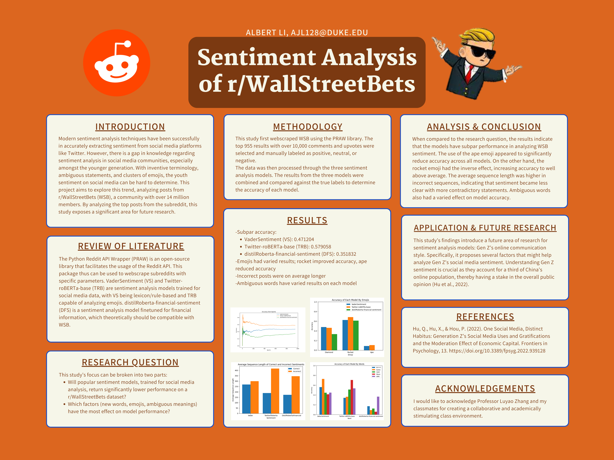

# Sentiment Analysis of r/WallStreetBets

## Project Information
- Author: Albert Li, Data Science, Class of 2027, Duke Kunshan University
- Instructor: Prof. Luyao Zhang, Duke Kunshan University
- Disclaimer: Submissions to the Final Project for STATS201 Introduction to Machine Learning for Social Science, 2023 Autumn Term (Seven Week - Second) instructed by Prof. Luyao Zhang at Duke Kunshan University.
- Acknowledgements: I would like to acknowledge Professor Luyao Zhang and my classmates for fostering a collaborative and academically stimulating class environment.

## Project Summary
- Modern sentiment analysis models have proven to accurately predict social media opinions on popular platforms like X (formerly Twitter) and Facebook. However, there is a gap in research into the sentiment analysis of Generation Z (Gen Z) social media, specifically, the usage of ambiguous words, emojis, and newly invented words. This research studies the performance of popular sentiment analysis models on r/WallStreetBets (WSB), a 14-million-member Reddit community infamous for its involvement in the Gamestop short squeeze. In addition, the research analyzes various features like post length, emojis, and ambiguous words. Using the results of this research, future studies will be performed on the optimization of machine learning models for new-generation social media sentiment. Additionally, the scope of future studies will be targeted toward financial sentiment analysis of WSB as a feature for financial asset price prediction.
- The questions this study aims to answer are:
  -  Will popular sentiment models trained for social media analysis return significantly lower performance on a WSB dataset?
  -  Which factors (new words, emojis, ambiguous meanings) affect model performance?

- Application Scenario
  - This study’s findings introduce a future area of research for sentiment analysis models: Gen Z’s online communication style. Specifically, it proposes several factors that might help analyze Gen Z's social media sentiment. Understanding Gen Z sentiment is crucial as they account for a third of China’s online population, thereby having a stake in the overall public opinion (Hu et al., 2022). Automating the acquisition of public sentiment will have major impacts in multiple sectors, streamlining the feedback process from individuals to companies, from citizens to governments, and from consumers to producers.

- Methodology
  - The methodology for this research project can be broken into three processes: data collection, model implementation, and data analysis. Each step can be accessed in this repository's "Code" folder. 
  - Data Collection
    - Without a publicly available dataset for WSB, this research begins with data collection and querying. This study utilizes the Python Reddit API Wrapper (PRAW) module, an open-source code library designed to facilitate the usage of the Reddit API. The code sorts the community by its top posts, filtering only for posts with over 10,000 upvotes and comments to ensure post quality and significance, accurately reflecting the community's general sentiment. The data was then manually labeled as positive (1), neutral (0), or negative (-1). The resultant dataset for this study was composed of 955 posts.
  - Model Implementation
    - As this research was designed to target social media sentiment, three popular social media sentiment analysis models were used: VaderSentiment (VS), Twitter-roBERTa-base (TRB), and distilRoberta-financial-sentiment (DFS). For sentiment prediction, each model segmented the post string into 128-character chunks to ensure proper model functionality. Each chunk was weighted by its string length and averaged to evaluate the post's sentiment.
  - Data Analysis
    - From the data, the average sequence length, top three emojis, and top five ambiguous words were extracted from relevant posts. These results were graphed and compared between models, highlighting the accuracy for each case.
 
- Results
  - The results indicated that sentiment analysis models indeed struggle in predicting WSB sentiment, with each model obtaining less than 70% accuracy. This result validates the necessity for future focus on this area of research and suggests that the differences between each generation's use of language are strong contributors to this drop in accuracy. The study looked at three of these cases: average post length, emoji usage, and ambiguous word usage. The average post length of the incorrect sequences was longer than that of correctly labeled ones, indicating that the models were likely confused by more sharply contrasting sentiments toward different topics. Additionally, the use of emoji had varied effects on model accuracy, with the rocket increasing accuracy and the ape significantly decreasing accuracy. While it is difficult to make conclusive judgments due to the many confounding variables, the posts with rockets likely incorporated more clear sentiment indications, resulting in an overall increase in accuracy. The inverse can be said about the ape, where the posts included conflicting keywords that confused the model. In these cases, the models did not see the proper significance and/or sentiment of the emojis, which commonly have a large impact on a post's sentiment. The use of ambiguous words also had varied effects on model performance, indicating that the ambiguous terms did not significantly impact the post's sentiment.

- Intellectual Merits and Practical Impacts
  - The study lays the groundwork for future research aimed at optimizing sentiment analysis models specifically for Generation Z's unique communication style. Collaborations between linguistic experts and machine learning engineers can lead to the development of models that better understand and interpret ambiguous words, emojis, and newly invented terms commonly used by Gen Z. The findings emphasize the importance of adapting sentiment analysis models to evolving language patterns on social media platforms like Reddit. As Gen Z continues to shape online discourse, optimized models can provide more accurate and nuanced insights into public sentiment, benefiting sectors ranging from marketing and customer feedback to public opinion analysis for governments. Building on the study's focus on r/WallStreetBets, future research could explore the integration of sentiment analysis models into financial analytics. Understanding sentiment on platforms like WSB could be crucial for predicting market trends, especially in the context of meme stocks and the influence of online communities on financial markets. 

  - Given that Generation Z is a global demographic, future studies could expand the scope to analyze cross-cultural variations in social media sentiment. This could involve investigating how linguistic nuances and communication styles differ among Gen Z users in various regions, contributing to more culturally sensitive sentiment analysis models. The research opens avenues for the development of real-time social listening tools capable of tracking and analyzing sentiment trends on platforms dominated by Gen Z. Such tools could empower businesses, governments, and organizations to respond promptly to emerging sentiments, enabling agile decision-making and adaptive strategies.

## Repository Table of Contents

#### 1. **[Literature](#literature)**
#### 2. **[Methods](#method)**
#### 3. **[Data](#data)**
#### 4. **[Code](#code)**
#### 5. **[Results](#results)**
#### 6. **[Spotlight](#spotlight)**
#### 7. **[More About the Author](#more-about-the-author)**
#### 8. **[References](#references)**

## Literature

[Folder](https://github.com/Rising-Stars-by-Sunshine/Stats_201_AlbertLi/tree/main/literature) containing documentation and literature to elucidate the study's goals and findings.

## Methods

[Folder](./method) containing documentation to outline the methodologies the project employed.

## Code

### Data Extraction

The data extraction process involved accessing the Reddit API and retrieving posts meeting the specified criteria. The extracted data included post content, upvote count, and the number of comments for each post. This dataset was then manually labeled to create true labels, which would be used to compare the results of sentiment analysis models.

### Sentiment Analysis Models

After data preparation, three sentiment analysis models were employed to analyze the labeled dataset. The models used were:

1. [VaderSentiment](https://github.com/cjhutto/vaderSentiment#python-demo-and-code-examples): Model designed for sentiment analysis on text data and provides a polarity score for each post.

2. [Twitter-roBERTa-base](https://huggingface.co/cardiffnlp/twitter-roberta-base-sentiment-latest): Leverages the roBERTa-base architecture, fine-tuned on Twitter data.

3. [distilRoberta-financial-sentiment](https://huggingface.co/mrm8488/distilroberta-finetuned-financial-news-sentiment-analysis): Model fine-tuned specifically for financial sentiment analysis.

[Folder](https://github.com/Rising-Stars-by-Sunshine/Stats_201_AlbertLi/tree/main/code) containing the various sentiment analysis models from prior high-performing models.

## Data

[Folder](https://github.com/Rising-Stars-by-Sunshine/Stats_201_AlbertLi/tree/main/data) containing the data and the data querying method.

## Results

[Folder](./results) containing data analysis and answers to research questions.

## Spotlight


## More About The Author
## Albert Li


I'm a freshman at Duke Kunshan University (DKU) with a passion for both STEM and finance, although I haven't settled on a specific major just yet. I'm excited to explore the intersection of these fields and discover where my interests lie. In addition to my academic pursuits, I'm an active member of the DKU Finance Club and the DKU Pre-Law Society, allowing me to engage in discussions related to finance, investment, and economic trends, as well as explore the legal aspects of business and finance. Beyond my club involvement, I'm always seeking new opportunities to broaden my horizons and make meaningful connections on campus, believing that diverse experiences will guide me toward a fulfilling academic and professional journey at DKU.

### Final Reflections
- Intellectual Growth:
  - In this course, my intellectual growth has centered on applying machine learning to complex social and economic issues, with a particular focus on the emerging field of new-generation social media sentiment analysis. This research has expanded my technical skills and deepened my understanding of the societal impact of sentiment analysis in the digital age. Exploring platforms like Reddit and Twitter, especially in the context of finance and trading on r/WallStreetBets, has revealed valuable insights into online community dynamics. This intersection of machine learning and social media analysis has added complexity to my journey, prompting considerations of ethical implications and societal responsibilities.
- Professional Growth:
  - My professional growth in this course has been enhanced by applying machine learning to social and economic challenges, specifically in the dynamic field of new-generation social media sentiment analysis. This focus has elevated my technical proficiency and deepened my awareness of the modern societal implications of sentiment analysis, particularly within online communities like Reddit and X. This intersection of machine learning and social media analysis is another step of my professional journey, fostering considerations of ethics and societal responsibilities. Embracing interdisciplinary research, I've honed my ability to merge technology and society, altering my perspective on the potential impacts of machine learning applications in both social and economic spheres.
- Living a Purposeful Life:
  - Envisioning my future contribution, I aim to be a leading figure in machine learning. If I were to win the Nobel Prize or Turing Award, I hope the summary would highlight my commitment to using machine learning for societal benefit. I aspire to pioneer innovative solutions that bring positive changes at the crossroads of technology, society, and economics. Ultimately, my goal is to contribute to self-fulfillment by leveraging AI for meaningful progress and positive societal impact.


## References

### Code Source

- [VaderSentiment](https://github.com/cjhutto/vaderSentiment#python-demo-and-code-examples)
- [Twitter-roBERTa-base](https://huggingface.co/cardiffnlp/twitter-roberta-base-sentiment-latest)
- [distilRoberta-financial-sentiment](https://huggingface.co/mrm8488/distilroberta-finetuned-financial-news-sentiment-analysis)
- [PRAW](https://github.com/praw-dev/praw)

### Articles and Literature

Barbieri, Francesco, Jose Camacho-Collados, Leonardo Neves, and Luis Espinosa-Anke. 2020. “TWEETEVAL: Unified Benchmark and Comparative Evaluation for Tweet Classification.” https://arxiv.org/pdf/2010.12421.pdf.

Hutto, C.J., and Eric Gilbert. 2014. “VADER: A Parsimonious Rule-Based Model for Sentiment Analysis of Social Media Text.” Proceedings of the International AAAI Conference on Web and Social Media 8 (1). https://ojs.aaai.org/index.php/ICWSM/article/view/14550.

Lyócsa, Štefan, Eduard Baumöhl, and Tomáš Výrost. 2021. “YOLO Trading: Riding with the Herd during the GameStop Episode.” Finance Research Letters 46 (July): 102359. https://doi.org/10.1016/j.frl.2021.102359.

Malik, Muhammad Shahid Iqbal, Anna Nazarova, Mona Mamdouh Jamjoom, and Dmitry I. Ignatov. 2023. “Multilingual Hope Speech Detection: A Robust Framework Using Transfer Learning of Fine-Tuning RoBERTa Model.” Journal of King Saud University - Computer and Information Sciences 35 (8): 101736. https://doi.org/10.1016/j.jksuci.2023.101736.

Nobanee, Haitham, and Nejla Ould Daoud Ellili. 2023. “What Do We Know about Meme Stocks? A Bibliometric and Systematic Review, Current Streams, Developments, and Directions for Future Research.” International Review of Economics & Finance 85 (May): 589–602. https://doi.org/10.1016/j.iref.2023.02.012.

Rodríguez-Ibánez, Margarita, Antonio Casánez-Ventura, Félix Castejón-Mateos, and Pedro-Manuel Cuenca-Jiménez. 2023. “A Review on Sentiment Analysis from Social Media Platforms.” Expert Systems with Applications 223 (March): 119862. https://doi.org/10.1016/j.eswa.2023.119862.

Sanh, Victor, Lysandre Debut, Julien Chaumond, and Thomas Wolf. 2019. “DistilBERT, a Distilled Version of BERT: Smaller, Faster, Cheaper and Lighter.” ArXiv.org. 2019. https://arxiv.org/abs/1910.01108.

Suhaimin, Mohd, Ahmad Hijazi, Ervin Gubin Moung, Puteri N. E. Nohuddin, Stephanie Chua, and Frans Coenen. 2023a. “Social Media Sentiment Analysis and Opinion Mining in Public Security: Taxonomy, Trend Analysis, Issues and Future Directions.” Journal of King Saud University - Computer and Information Sciences 35 (9): 101776–76. https://doi.org/10.1016/j.jksuci.2023.101776.

Xu, Qianwen Ariel, Victor Chang, and Chrisina Jayne. 2022. “A Systematic Review of Social Media-Based Sentiment Analysis: Emerging Trends and Challenges.” Decision Analytics Journal 3 (June): 100073. https://doi.org/10.1016/j.dajour.2022.100073.

```bibtex

@article{suhaimin_2023_social,
  author = {Suhaimin, Mohd and Hijazi, Ahmad and Ervin Gubin Moung and Puteri N. E. Nohuddin and Chua, Stephanie and Coenen, Frans},
  month = {10},
  pages = {101776-101776},
  publisher = {Elsevier BV},
  title = {Social Media Sentiment Analysis and Opinion Mining in Public Security: Taxonomy, Trend Analysis, Issues and Future Directions},
  doi = {10.1016/j.jksuci.2023.101776},
  urldate = {2023-11-17},
  volume = {35},
  year = {2023},
  journal = {Journal of King Saud University - Computer and Information Sciences}
}

@article{rodrguezibnez_2023_a,
  author = {Rodríguez-Ibánez, Margarita and Casánez-Ventura, Antonio and Castejón-Mateos, Félix and Cuenca-Jiménez, Pedro-Manuel},
  month = {03},
  pages = {119862},
  title = {A Review on Sentiment Analysis from Social Media Platforms},
  doi = {10.1016/j.eswa.2023.119862},
  volume = {223},
  year = {2023},
  journal = {Expert Systems with Applications}
}

@article{nobanee_2023_what,
  author = {Nobanee, Haitham and Ellili, Nejla Ould Daoud},
  month = {05},
  pages = {589-602},
  title = {What do we know about meme stocks? A bibliometric and systematic review, current streams, developments, and directions for future research},
  doi = {10.1016/j.iref.2023.02.012},
  volume = {85},
  year = {2023},
  journal = {International Review of Economics & Finance}
}

@article{xu_2022_a,
  author = {Xu, Qianwen Ariel and Chang, Victor and Jayne, Chrisina},
  month = {06},
  pages = {100073},
  title = {A systematic review of social media-based sentiment analysis: Emerging trends and challenges},
  doi = {10.1016/j.dajour.2022.100073},
  volume = {3},
  year = {2022},
  journal = {Decision Analytics Journal}
}

@article{malik_2023_multilingual,
  author = {Malik, Muhammad Shahid Iqbal and Nazarova, Anna and Jamjoom, Mona Mamdouh and Ignatov, Dmitry I.},
  month = {09},
  pages = {101736},
  title = {Multilingual hope speech detection: A Robust framework using transfer learning of fine-tuning RoBERTa model},
  doi = {10.1016/j.jksuci.2023.101736},
  url = {https://www.sciencedirect.com/science/article/pii/S1319157823002902},
  urldate = {2023-12-13},
  volume = {35},
  year = {2023},
  journal = {Journal of King Saud University - Computer and Information Sciences}
}

@article{lycsa_2021_yolo,
  author = {Lyócsa, Štefan and Baumöhl, Eduard and Výrost, Tomáš},
  month = {07},
  pages = {102359},
  title = {YOLO trading: Riding with the herd during the GameStop episode},
  doi = {10.1016/j.frl.2021.102359},
  volume = {46},
  year = {2021},
  journal = {Finance Research Letters}
}

@article{hutto_2014_vader,
  author = {Hutto, C.J. and Gilbert, Eric},
  month = {05},
  title = {VADER: A Parsimonious Rule-Based Model for Sentiment Analysis of Social Media Text},
  url = {https://ojs.aaai.org/index.php/ICWSM/article/view/14550},
  volume = {8},
  year = {2014},
  journal = {Proceedings of the International AAAI Conference on Web and Social Media}
}

@misc{barbieri_2020_tweeteval,
  author = {Barbieri, Francesco and Camacho-Collados, Jose and Neves, Leonardo and Espinosa-Anke, Luis},
  month = {10},
  title = {TWEETEVAL: Unified Benchmark and Comparative Evaluation for Tweet Classification},
  url = {https://arxiv.org/pdf/2010.12421.pdf},
  year = {2020}
}

@misc{sanh_2019_distilbert,
  author = {Sanh, Victor and Debut, Lysandre and Chaumond, Julien and Wolf, Thomas},
  title = {DistilBERT, a distilled version of BERT: smaller, faster, cheaper and lighter},
  url = {https://arxiv.org/abs/1910.01108},
  year = {2019},
  organization = {arXiv.org}
}

```
