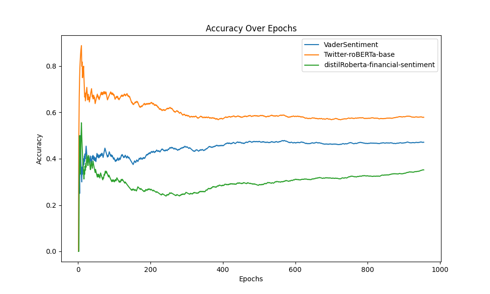

# Webscraping

This section of the code is dedicated to web scraping using the PRAW (Python Reddit API Wrapper) library. The goal was to extract valuable information from r/WallStreetBets, focusing on three key elements: post content, upvotes, and comments. The Reddit API was accessed with appropriate credentials, allowing for the extraction of every post from r/WallStreetBets over the past year. To ensure data quality, only posts with a minimum of 250 upvotes and comments were included. This criterion was chosen to highlight posts with substantial community interaction, indicating potential shifts in sentiment or opinions related to specific assets or the market as a whole.

See [Jupyter Notebook](./query/data-query.ipynb). Also see [PRAW](https://praw.readthedocs.io/en/stable/) for more details.

## Prerequisites

1. Install Dependencies:
```python
pip install praw
```
2. Obtain Reddit API credentials. See [Reddit API](https://www.reddit.com/dev/api/) for more details.

### Reddit API Setup

1. Create a Reddit account [here](https://www.reddit.com/register/).

2. [Create a Reddit app](https://www.reddit.com/prefs/apps) for personal use. Fill out the name, description, about URL, and redirect URI as desired.


3. Extract the "personal use script", "secret", and your application name. These will be your client_id, client_secret, and user_agent.


#### Example API Credentials
```python
client_id = 'APKqZnss-DuMurcab6oLbf'
client_secret = 'iKTVvJdfAXkdgt2BVWQ'
user_agent = 'dku-stats-201 (by u/Alb3r7-Li)'
```

## Pseudocode
```
1. Initialization and Imports:
   - Import the necessary libraries for the program: praw for Reddit API access, time for introducing delays, json for handling JSON data, and csv for working with CSV files.
3. Reddit API Setup:
   - Set up the Reddit API connection using the PRAW library with provided API credentials.
4. Subreddit Selection:
   - Choose the subreddit to analyze, in this case, "WallStreetBets."
5. Data Storage Initialization:
   - Create an empty list named data to store information about Reddit posts.
6. Function Definition:
   - Define a function named dataStore that takes in various details of a Reddit post and returns them as a dictionary.
7. Loop Through Top Posts:
   - Iterate through the top 2000 posts in the selected subreddit.
   - Extract relevant information (post ID, title, content, upvotes, and number of comments) from each post.
   - Append this information as a dictionary to the data list.
8. Delay for API Limitation:
   - Introduce a delay of 6 seconds after processing each post to avoid exceeding the Reddit API access limit.
9. Data Conversion to JSON:
    - Convert the collected data (list of dictionaries) into a formatted JSON string.
10. JSON Loading:
    - Load the JSON string back into a Python list for further processing.
11. CSV File Creation:
    - Specify the name of the CSV file.
12. CSV Writing:
    - Open the CSV file and create a CSV writer.
    - Write the header using keys from the first dictionary in the data list.
    - Iterate through the data list and write each dictionary as a row in the CSV file.
```
## Sample Code

```python
import praw
from google.colab import userdata

# Set up PRAW with your Reddit API credentials
reddit = praw.Reddit(
    client_id= userdata.get('clientID'),
    client_secret= userdata.get('clientSecret'),
    user_agent= userdata.get('userAgent')
)

# Specify the subreddit you want to scrape
subreddit_name = 'WallStreetBets'
subreddit = reddit.subreddit(subreddit_name)

# Iterate through the top 5 hot posts in the subreddit
for submission in subreddit.hot(limit=5):
    # Extract relevant information
    post_id = submission.id
    post_title = submission.title
    post_content = submission.selftext
    upvotes = submission.score
    num_comments = submission.num_comments

    # Print or store the information as needed
    print(f"Post ID: {post_id}")
    print(f"Title: {post_title}")
    print(f"Content: {post_content}")
    print(f"Upvotes: {upvotes}")
    print(f"Number of Comments: {num_comments}")
    print("\n" + "-" * 50 + "\n")
```

# Sentiment Analysis Models

See [Jupyter Notebook](./processing/data-processing.ipynb).

This section of the code involves processing the extracted data through three distinct sentiment analysis models: [VaderSentiment](https://github.com/cjhutto/vaderSentiment#python-demo-and-code-examples), [Twitter-roBERTa-base](https://huggingface.co/cardiffnlp/twitter-roberta-base-sentiment-latest), and [distilRoberta-financial-sentiment](https://huggingface.co/mrm8488/distilroberta-finetuned-financial-news-sentiment-analysis). The objective is to analyze the sentiment expressed in the WallStreetBets posts and compare the results against manually labeled true labels.

## Prerequisites
Install Dependencies:
```python
pip install vaderSentiment transformers emoji
```

## Pseudocode
```
1. Library Installation:
   - Install required libraries: vaderSentiment for sentiment analysis, transformers for using pre-trained models, and emoji version 0.6.0.
2. Imports:
   - Import necessary libraries: csv for handling CSV files, pandas for data manipulation, SentimentIntensityAnalyzer from vaderSentiment for sentiment analysis, and various components from transformers.
3. CSV File Handling:
   - Specify the input CSV file containing Reddit post data.
4. Data Extraction:
   - Read each row from the CSV file, assuming each row has at least 3 columns.
   - Create a list named sentences containing the concatenation of the second and third columns of each row (assuming the third column is not empty).
5. Sentiment Analysis with VADER:
   - Use the VADER sentiment analysis tool to analyze the sentiment of each sentence in the sentences list.
   - Convert the continuous sentiment score to discrete labels (1 for positive, 0 for neutral, -1 for negative).
6. Sentiment Analysis with CardiffNLP Model:
   - Utilize the cardiffnlp/twitter-roberta-base-sentiment-latest model from Hugging Face for sentiment analysis.
   - Process sentences in chunks of length 128, and accumulate sentiment scores for each sentence.
   - Calculate the overall sentiment label and score for each sentence based on accumulated scores.
7. Sentiment Analysis with Financial News Model:
   - Use the mrm8488/distilroberta-finetuned-financial-news-sentiment-analysis model from Hugging Face for financial news sentiment analysis.
   - Similar to the CardiffNLP model, process sentences in chunks of length 128 and accumulate sentiment scores for each sentence.
   - Calculate the overall sentiment label and score for each sentence based on accumulated scores.
8. Output CSV File Handling:
   - Specify the output CSV file name.
9. Pandas DataFrame Manipulation:
   - Read the original CSV file into a Pandas DataFrame.
   - Add three new columns ('s1', 's2', 's3') to the DataFrame, containing the sentiment labels from the three sentiment analysis methods.
10. Write Processed Data to CSV:
   - Write the updated DataFrame, now including sentiment labels, back to a new CSV file.
```
## Sample Code

```python
# VaderSentiment

import csv
import pandas as pd
from vaderSentiment.vaderSentiment import SentimentIntensityAnalyzer

# Replace 'your_file.csv' with the actual file name
csv_file = '/content/reddit-labeled-output.csv'

sentences = []

with open(csv_file, 'r') as file:
    reader = csv.reader(file)
    
    for row in reader:
        # Assuming each row has at least 3 columns
        sentences.append(row[1]+". "+row[2]) if len(row[2]) > 0 else sentences.append(row[1])  # Indexing starts from 0

sentences = sentences[1:]

sentiments = []
analyzer = SentimentIntensityAnalyzer()
for sentence in sentences:
    vs = analyzer.polarity_scores(sentence)
    sentiments.append(vs)

converted_sentiments = []
for sentiment in sentiments:
  val = sentiment['compound']
  if val >= 0.05:
    converted_sentiments.append(1)
  elif val < 0.05 and val > -0.05:
    converted_sentiments.append(0)
  else:
    converted_sentiments.append(-1)

# Replace 'your_file.csv' with the actual file name
output_csv_file = '/content/reddit-processed-output.csv'

# Read the CSV file into a pandas DataFrame
df = pd.read_csv(csv_file)

df['output'] = converted_sentiments

# Write the DataFrame with the new column back to a CSV file
df.to_csv(output_csv_file, index=False)
```

## Data Analysis

Data analysis compared the overall performance across the three sentiment analysis models. The first graph depicts the accuracy of each model graphed after each epoch. The second graph depicts the average sequence length for each model between correctly and incorrectly labeled posts. The third graph depicts the accuracy of each model on three emojis, and the fourth graph shows the accuracy of each model for five ambiguous words.

### Accuracy Plot


### Average Sequence Length


### Accuracy By Emoji


### Accuracy By Keyword


## Flowchart

