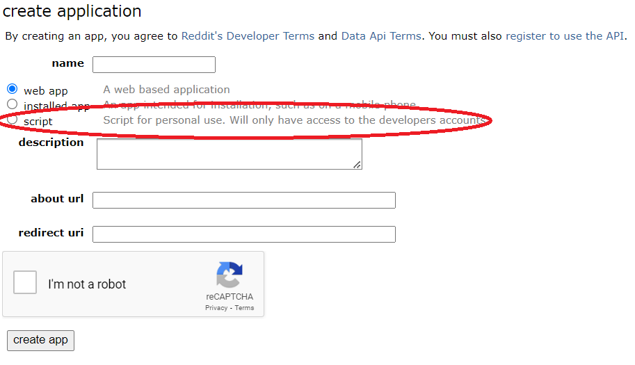
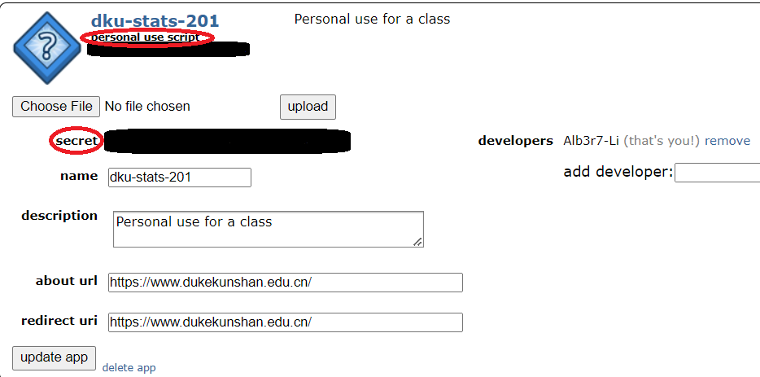
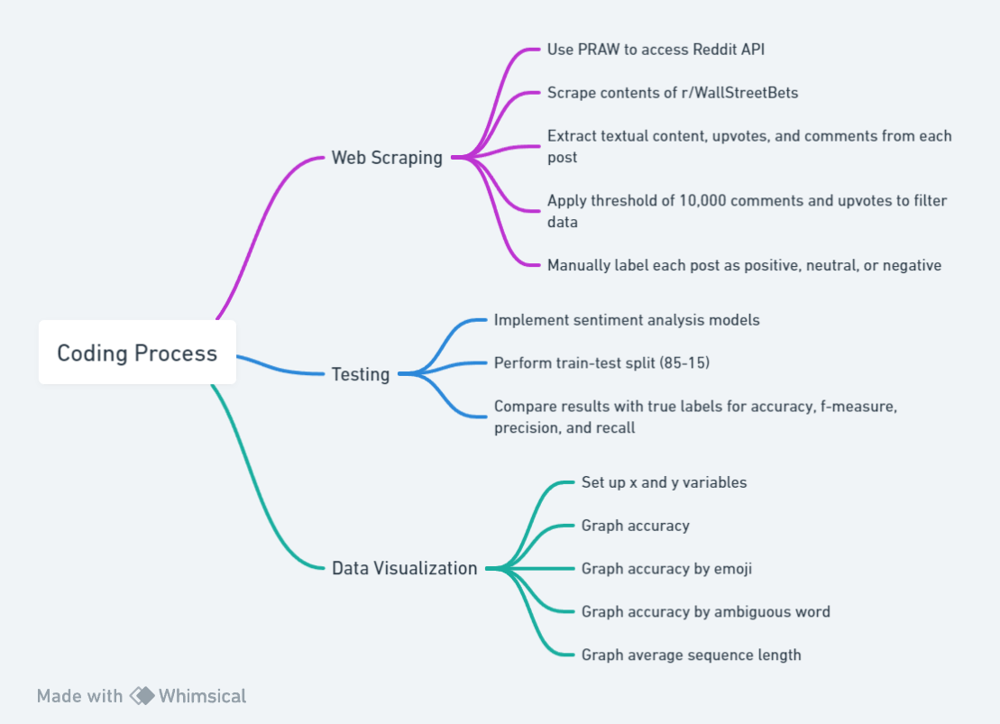

# Webscraping

This section of the code is dedicated to web scraping using the PRAW (Python Reddit API Wrapper) library. The goal was to extract valuable information from r/WallStreetBets, focusing on three key elements: post content, upvotes, and comments. The Reddit API was accessed with appropriate credentials, allowing for the extraction of every post from r/WallStreetBets over the past year. To ensure data quality, only posts with a minimum of 250 upvotes and comments were included. This criterion was chosen to highlight posts with substantial community interaction, indicating potential shifts in sentiment or opinions related to specific assets or the market as a whole.

See [Jupyter Notebook](./query/data-query.ipynb). Also see [PRAW](https://praw.readthedocs.io/en/stable/) for more details.

## Prerequisites

1. Install Dependencies:
```python
pip install praw
```
2. Obtain Reddit API credentials. See [Reddit API](https://www.reddit.com/dev/api/) for more details.

### Reddit API Setup

1. Create a Reddit account [here](https://www.reddit.com/register/).

2. [Create a Reddit app](https://www.reddit.com/prefs/apps) for personal use. Fill out the name, description, about URL, and redirect URI as desired.


3. Extract the "personal use script", "secret", and your application name. These will be your client_id, client_secret, and user_agent.



#### Example API Credentials
```python
client_id = 'APKqZnss-DuMurcab6oLbf'
client_secret = 'iKTVvJdfAXkdgt2BVWQ'
user_agent = 'dku-stats-201 (by u/Alb3r7-Li)'
```


## Sample Code

```python
import praw
from google.colab import userdata

# Set up PRAW with your Reddit API credentials
reddit = praw.Reddit(
    client_id= userdata.get('clientID'),
    client_secret= userdata.get('clientSecret'),
    user_agent= userdata.get('userAgent')
)

# Specify the subreddit you want to scrape
subreddit_name = 'WallStreetBets'
subreddit = reddit.subreddit(subreddit_name)

# Iterate through the top 5 hot posts in the subreddit
for submission in subreddit.hot(limit=5):
    # Extract relevant information
    post_id = submission.id
    post_title = submission.title
    post_content = submission.selftext
    upvotes = submission.score
    num_comments = submission.num_comments

    # Print or store the information as needed
    print(f"Post ID: {post_id}")
    print(f"Title: {post_title}")
    print(f"Content: {post_content}")
    print(f"Upvotes: {upvotes}")
    print(f"Number of Comments: {num_comments}")
    print("\n" + "-" * 50 + "\n")
```

# Sentiment Analysis Models

This section of the code involves processing the extracted data through three distinct sentiment analysis models: [VaderSentiment](https://github.com/cjhutto/vaderSentiment#python-demo-and-code-examples), [Twitter-roBERTa-base](https://huggingface.co/cardiffnlp/twitter-roberta-base-sentiment-latest), and [distilRoberta-financial-sentiment](https://huggingface.co/mrm8488/distilroberta-finetuned-financial-news-sentiment-analysis). The objective is to analyze the sentiment expressed in the WallStreetBets posts and compare the results against manually labeled true labels.

## Prerequisites
Install Dependencies:
```python
pip install vaderSentiment transformers emoji
```

## Sample Code

```python
# VaderSentiment

import csv
import pandas as pd
from vaderSentiment.vaderSentiment import SentimentIntensityAnalyzer

# Replace 'your_file.csv' with the actual file name
csv_file = '/content/reddit-labeled-output.csv'

sentences = []

with open(csv_file, 'r') as file:
    reader = csv.reader(file)
    
    for row in reader:
        # Assuming each row has at least 3 columns
        sentences.append(row[1]+". "+row[2]) if len(row[2]) > 0 else sentences.append(row[1])  # Indexing starts from 0

sentences = sentences[1:]

sentiments = []
analyzer = SentimentIntensityAnalyzer()
for sentence in sentences:
    vs = analyzer.polarity_scores(sentence)
    sentiments.append(vs)

converted_sentiments = []
for sentiment in sentiments:
  val = sentiment['compound']
  if val >= 0.05:
    converted_sentiments.append(1)
  elif val < 0.05 and val > -0.05:
    converted_sentiments.append(0)
  else:
    converted_sentiments.append(-1)

# Replace 'your_file.csv' with the actual file name
output_csv_file = '/content/reddit-processed-output.csv'

# Read the CSV file into a pandas DataFrame
df = pd.read_csv(csv_file)

df['output'] = converted_sentiments

# Write the DataFrame with the new column back to a CSV file
df.to_csv(output_csv_file, index=False)
```

## Flowchart

