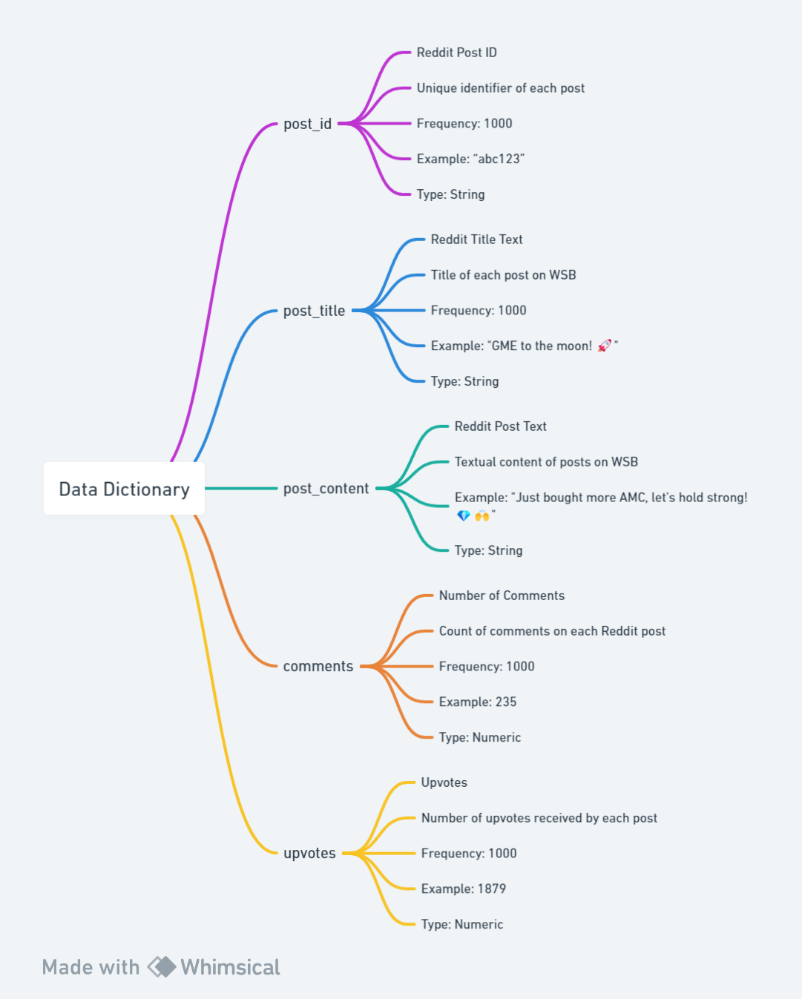

A Python script will be run to prepare the data, leveraging the PRAW (Python Reddit API Wrapper) library to extract post information from r/WallStreetBets. The focus is on three key elements: post content, upvotes, and comments. Using Reddit API credentials, PRAW will extract every post from r/WallStreetBets from the top of the past year. To sort for quality, only the posts with 250 upvotes and comments will be used. This is because posts with sufficient community interaction will indicate a potential shift in opinion or sentiment about a specific asset or the market altogether. The data will then be manually labeled to create a true label to compare the sentiment analysis models results to.

## Data Dictionary

| Variable Name   | Definition           | Description                                    | Frequency | Sample Observation                                      | Type      |
|:---------------:|:---------------------:|-----------------------------------------------|:---------:|:--------------------------------------------------------:|:---------:|
| `post_id`       | Reddit Post ID        | The unique identifier of each post.            | 1000      | "abc123"                                                 | String    |
| `post_title`    | Reddit Title Text      | The title of posts on r/WallStreetBets.        | 1000      | "GME to the moon! 🚀"                                     | String    |
| `post_content`  | Reddit Post Text      | The textual content of posts on r/WallStreetBets. | 1000    | "Just bought more AMC, let's hold strong! 💎🙌"           | String    |
| `comments`      | Number of Comments    | The count of comments on each Reddit post.      | 1000      | 235                                                      | Numeric   |
| `upvotes`       | Upvotes               | The number of upvotes received by each post.    | 1000      | 1879                                                     | Numeric   |

## Flowchart

