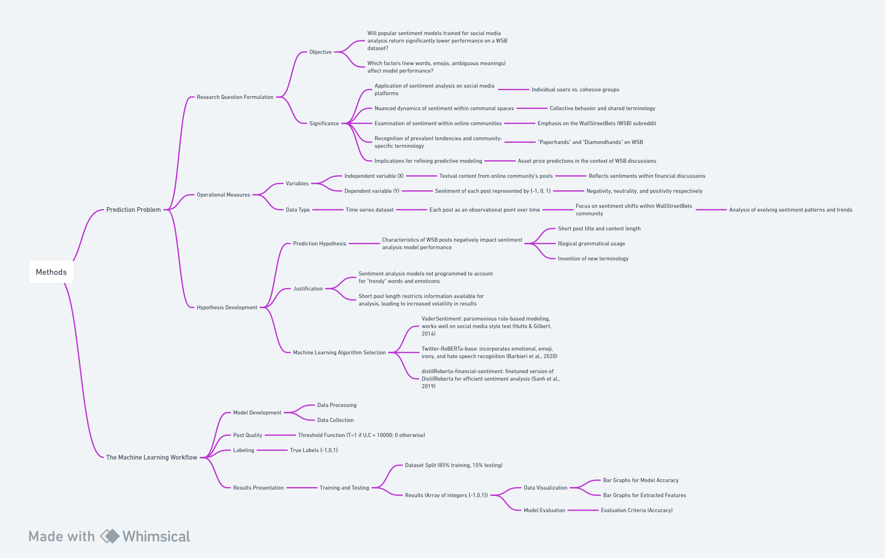

# Methods

## Flowchart


## Prediction Problem

## Research Question Formulation

### Objective

This paper aimed to examine how different sentiment analysis models performed on Reddit posts. I specifically looked at r/WallStreetBets (WSB), a subreddit with over 14 million members known for finance and trading discussions. WSB was infamous for influencing market fluctuations, especially in "meme stocks" that attracted intense but short-lived interest (Nobanee & Ellili, 2023). The GameStop short squeeze in 2021, orchestrated by WSB members, was a key example.

I compared various sentiment analysis models to understand how well they captured sentiment in WSB discussions about finance, trading, and meme stocks. The goal was to see which models could best analyze the emotional tone in these posts. Additionally, I analyzed three features--emojis, average sequence length, and ambiguous words-- to see the impact and significance of these factors on sentiment performance.

In essence, my research questions come down to the following:
- Will popular sentiment models trained for social media analysis return significantly lower performance on a WSB dataset?
- Which factors (new words, emojis, ambiguous meanings) affect model performance?

### Significance

Prior research has delved into the application of sentiment analysis on various social media platforms; however, these studies typically focused on individual users rather than cohesive groups (Rodríguez-Ibánez et al., 2023; Suhaimin et al., 2023). A notable gap in the literature exists regarding the nuanced dynamics of sentiment within communal spaces, where collective behavior and shared terminology play a pivotal role. This study aims to address this gap by examining sentiment within the context of online communities, with a particular emphasis on the WallStreetBets (WSB) subreddit.

When analyzing posts within a community setting, it is important to recognize prevalent tendencies and the emergence of community-specific terminology. On WSB, for instance, users frequently use fabricated words such as "Paperhands" and "Diamondhands" to articulate their intended trading decisions. The adoption and shared understanding of these terms contribute to the formation of a unique linguistic ecosystem within the community. Understanding these communal expressions is integral to deciphering sentiment accurately, as they encapsulate the collective sentiment and market outlook of WSB participants.

Beyond linguistic nuances, investigating the consensus sentiment within online communities like WSB holds significant implications for refining predictive modeling, particularly in the context of asset price predictions. By discerning the prevailing sentiment within the community, sentiment analysis models can enhance their ability to forecast price movements and trends associated with assets frequently discussed on the subreddit.

## Operational Measures

### Variables

The central framework of this study hinges on the distinction between the independent variable (X) and the dependent variable (Y), focusing on unraveling sentiment dynamics within online platforms. The independent variable, X, encapsulates the textual content derived from the targeted online community's posts, presenting a diverse linguistic landscape reflecting the sentiments of community members, particularly within financial discussions. The dependent variable, Y, characterizes the sentiment of each post through a set of labels {-1, 0, 1}, representing negativity, neutrality, and positivity, respectively. This binary categorization system establishes a structured foundation for analyzing the intricate relationship between textual content and sentiment labels, aiming to discern patterns and trends within the community's expressions and contribute to a deeper understanding of sentiment dynamics in the chosen online environment.

### Data Type

The dataset under scrutiny for this study is structured as a time series, wherein each post functions as an observational point within a sequential framework over time. In contrast to conventional user-centric analyses, the primary focus here is on elucidating nuanced shifts in sentiment within the WallStreetBets (WSB) community over distinct temporal intervals. Each post serves as a temporal data point, facilitating a meticulous exploration of evolving sentiment patterns, trends, and fluctuations within the dynamic landscape of WSB. This temporal perspective provides a detailed analysis of how sentiment within the community transforms and adapts over discernible periods, potentially offering insights into the impact of external events, market dynamics, or community-driven phenomena on the collective mood and sentiment expressed in WSB posts.

## Hypothesis Development

### Prediction Hypothesis

Although numerous models can accurately predict social media sentiment, the performance will significantly decrease when used to analyze WSB posts. Reddit post’s characteristics—short post title and content length, illogical grammatical usage, and the invention of new terminology—will be strongly correlated to the decrease in model performance.

### Justification

Most sentiment analysis models are based on assigning intensity values to words from the standardized English dictionary. This means, however, that they are not programmed to account for unknown variables such as “trendy” words and emoticons. Also, the short post length severely restricts the amount of information each model has to work with, and I believe this will lead to an increased volatility in results. Overall, these three factors should be negatively correlated to model performance.

### Machine Learning Algorithm Selection

As the study focuses on predicting WSB post sentiment, the selected machine learning algorithms utilized natural language processing (NLP) techniques, known to be the most effective in analyzing textual content for sentiment analysis. VaderSentiment uses parsimonious rule-based modeling, allowing for their engine to "work well on social media style text, yet readily generalizable to multiple domains" (Hutto & Gilbert, 2014). Twitter-RoBERTa-base modifies RoBERTa to incorporate emotional, emoji, irony, and hate speech recognition (Barbieri et al., 2020). distilRoberta-financial-sentiment is a finetuned version of DistilRoberta, a more efficient alternative to BERT (Sanh et al., 2019).

## The Machine Learning Workflow

## Model Development

### Data Processing

#### Data Collection

Posts were obtained by scraping the subreddit for textual content, ID, and post popularity (upvotes and comments).

#### Post Quality

The dataset’s quality is ensured by filtering posts on the following threshold:

  T=1 if U,C > 10000; 0 otherwise

where T is the indicator thresholding function, U is the number of upvotes, and C is the number of comments.

#### Labeling

To perform prediction on the self-made dataset, I manually labeled the data. The sample space of the true labels is {-1,0,1}, representing negative, neutral, and positive, respectively.

## Results Presentation

### Training and Testing

#### Dataset Split

Since I can determine the number of posts to use, the dataset was split 85-15 for training and testing. 

#### Results

The result of these models is an array of integers in the subset {-1,0,1}. Each index in the array corresponds to a post’s sentiment from the input information.

### Data Visualization

To visualize the results, I used bar graphs, comparing each model’s accuracy from its respective research to the accuracy when running on the new dataset. I also created bar graphs for each of the three extracted features, separating the data by emoji, model, and ambiguous word respectively.

## Model Evaluation

### Evaluation Criteria

I used accuracy to evaluate the performance of each model and compared it for each of the features. The accuracy was then evaluated with 0.80 as an acceptable performance.

### Iterative Improvement

To accurately predict WSB sentiment, the models need to be adjusted to account for the unknown terminology. I came up with three methods for accomplishing this:

- Amending dictionary: The most direct approach to predict WSB sentiment will be manually adding and assigning intensity values for each unknown word.
- Hypersensitivity: Since sentiment analysis models are designed for longer strings, amplifying the intensity of each word or emoji might improve the model’s accuracy.
- Utilize comments: While comments can be very short, combining (2) with a post’s comments might provide additional context to supplement the post’s brief content.


## References

Barbieri, Francesco, Jose Camacho-Collados, Leonardo Neves, and Luis Espinosa-Anke. 2020. “TWEETEVAL: Unified Benchmark and Comparative Evaluation for Tweet Classification.” https://arxiv.org/pdf/2010.12421.pdf.

Hutto, C.J., and Eric Gilbert. 2014. “VADER: A Parsimonious Rule-Based Model for Sentiment Analysis of Social Media Text.” Proceedings of the International AAAI Conference on Web and Social Media 8 (1). https://ojs.aaai.org/index.php/ICWSM/article/view/14550.

Nobanee, Haitham, and Nejla Ould Daoud Ellili. 2023. “What Do We Know about Meme Stocks? A Bibliometric and Systematic Review, Current Streams, Developments, and Directions for Future Research.” International Review of Economics & Finance 85 (May): 589–602. https://doi.org/10.1016/j.iref.2023.02.012.

Rodríguez-Ibánez, Margarita, Antonio Casánez-Ventura, Félix Castejón-Mateos, and Pedro-Manuel Cuenca-Jiménez. 2023. “A Review on Sentiment Analysis from Social Media Platforms.” Expert Systems with Applications 223 (March): 119862. https://doi.org/10.1016/j.eswa.2023.119862.

Sanh, Victor, Lysandre Debut, Julien Chaumond, and Thomas Wolf. 2019. “DistilBERT, a Distilled Version of BERT: Smaller, Faster, Cheaper and Lighter.” ArXiv.org. 2019. https://arxiv.org/abs/1910.01108.

Suhaimin, Mohd, Ahmad Hijazi, Ervin Gubin Moung, Puteri N. E. Nohuddin, Stephanie Chua, and Frans Coenen. 2023. “Social Media Sentiment Analysis and Opinion Mining in Public Security: Taxonomy, Trend Analysis, Issues and Future Directions.” Journal of King Saud University - Computer and Information Sciences 35 (9): 101776–76. https://doi.org/10.1016/j.jksuci.2023.101776.

Xu, Qianwen Ariel, Victor Chang, and Chrisina Jayne. 2022. “A Systematic Review of Social Media-Based Sentiment Analysis: Emerging Trends and Challenges.” Decision Analytics Journal 3 (June): 100073. https://doi.org/10.1016/j.dajour.2022.100073.

```bibtex
@misc{barbieri_2020_tweeteval,
  author = {Barbieri, Francesco and Camacho-Collados, Jose and Neves, Leonardo and Espinosa-Anke, Luis},
  month = {10},
  title = {TWEETEVAL: Unified Benchmark and Comparative Evaluation for Tweet Classification},
  url = {https://arxiv.org/pdf/2010.12421.pdf},
  year = {2020}
}

@article{hutto_2014_vader,
  author = {Hutto, C.J. and Gilbert, Eric},
  month = {05},
  title = {VADER: A Parsimonious Rule-Based Model for Sentiment Analysis of Social Media Text},
  url = {https://ojs.aaai.org/index.php/ICWSM/article/view/14550},
  volume = {8},
  year = {2014},
  journal = {Proceedings of the International AAAI Conference on Web and Social Media}
}

@article{nobanee_2023_what,
  author = {Nobanee, Haitham and Ellili, Nejla Ould Daoud},
  month = {05},
  pages = {589-602},
  title = {What do we know about meme stocks? A bibliometric and systematic review, current streams, developments, and directions for future research},
  doi = {10.1016/j.iref.2023.02.012},
  volume = {85},
  year = {2023},
  journal = {International Review of Economics & Finance}
}

@article{rodrguezibnez_2023_a,
  author = {Rodríguez-Ibánez, Margarita and Casánez-Ventura, Antonio and Castejón-Mateos, Félix and Cuenca-Jiménez, Pedro-Manuel},
  month = {03},
  pages = {119862},
  title = {A Review on Sentiment Analysis from Social Media Platforms},
  doi = {10.1016/j.eswa.2023.119862},
  volume = {223},
  year = {2023},
  journal = {Expert Systems with Applications}
}

@misc{sanh_2019_distilbert,
  author = {Sanh, Victor and Debut, Lysandre and Chaumond, Julien and Wolf, Thomas},
  title = {DistilBERT, a distilled version of BERT: smaller, faster, cheaper and lighter},
  url = {https://arxiv.org/abs/1910.01108},
  year = {2019},
  organization = {arXiv.org}
}

@article{suhaimin_2023_social,
  author = {Suhaimin, Mohd and Hijazi, Ahmad and Ervin Gubin Moung and Puteri N. E. Nohuddin and Chua, Stephanie and Coenen, Frans},
  month = {10},
  pages = {101776-101776},
  publisher = {Elsevier BV},
  title = {Social Media Sentiment Analysis and Opinion Mining in Public Security: Taxonomy, Trend Analysis, Issues and Future Directions},
  doi = {10.1016/j.jksuci.2023.101776},
  urldate = {2023-11-17},
  volume = {35},
  year = {2023},
  journal = {Journal of King Saud University - Computer and Information Sciences}
}

@article{xu_2022_a,
  author = {Xu, Qianwen Ariel and Chang, Victor and Jayne, Chrisina},
  month = {06},
  pages = {100073},
  title = {A systematic review of social media-based sentiment analysis: Emerging trends and challenges},
  doi = {10.1016/j.dajour.2022.100073},
  volume = {3},
  year = {2022},
  journal = {Decision Analytics Journal}
}
```
