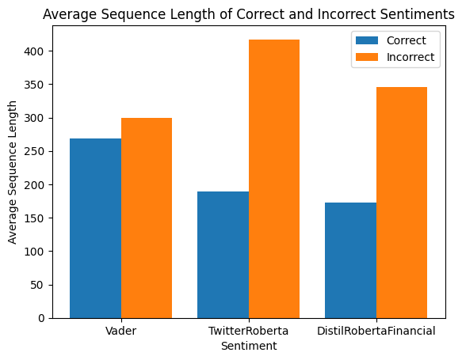
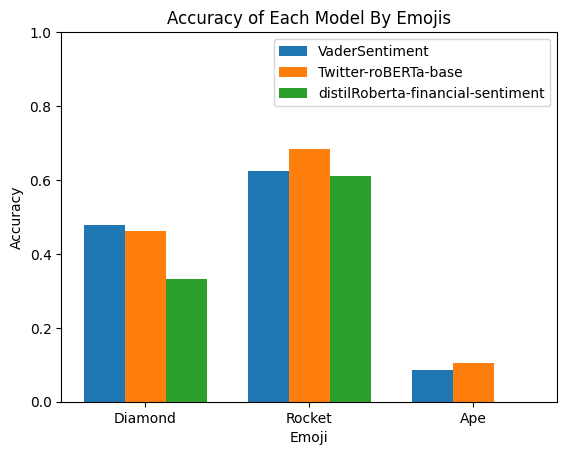
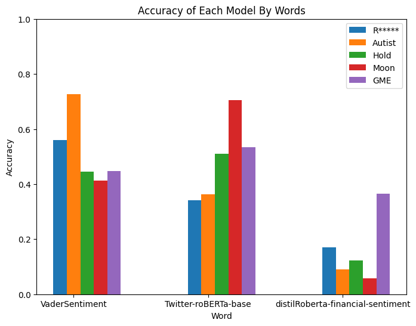

# Results

### Accuracy Plot

### Accuracy
- VaderSentiment: 0.471204
- Twitter-roBERTa-base: 0.579058
- distilRoberta-financial-sentiment: 0.351832
---

Using 0.80 as a measurement for acceptable performance, the accuracy above indicates that the models have subpar performance on the r/WallStreetBets dataset. This indicates that these models are also unable to accurately predict Generation Z sentiments.

### Average Sequence Length

### Accuracy By Emoji

### Accuracy By Keyword

For each of the following,
