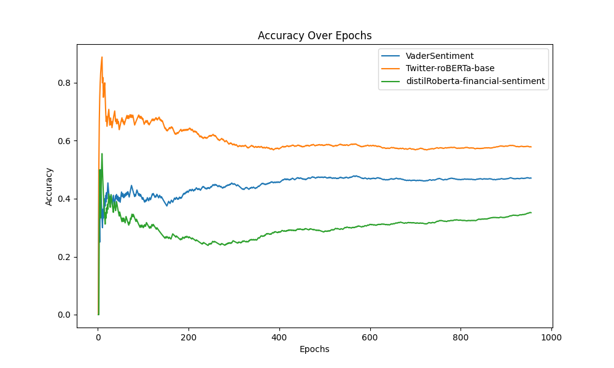
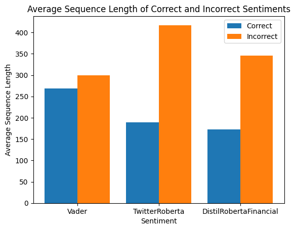
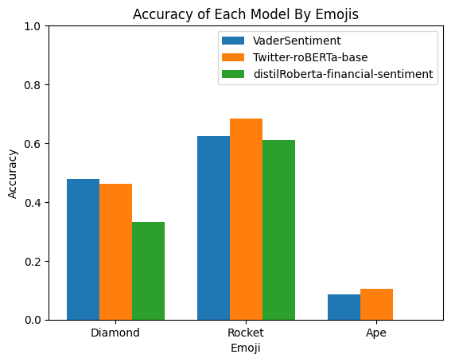
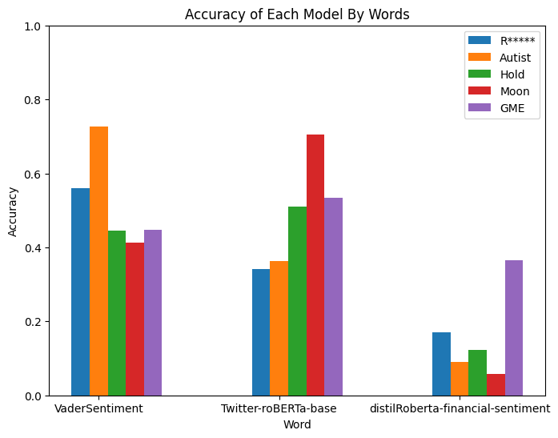

# Results

### Accuracy Plot

### Accuracy
- VaderSentiment: 0.471204
- Twitter-roBERTa-base: 0.579058
- distilRoberta-financial-sentiment: 0.351832
---

Using 0.80 as a measurement for acceptable performance, the accuracy above indicates that the models have subpar performance on the r/WallStreetBets dataset. This indicates that these models are also unable to accurately predict Generation Z sentiments, confirming my first research question.

### Average Sequence Length

### Accuracy By Emoji

### Accuracy By Keyword

To answer the second research question, I analyzed the three graphs above. The use of the ape emoji appeared to significantly reduce accuracy across all models. On the other hand, the rocket emoji had the inverse effect, increasing accuracy to well above average. The average sequence length was higher in incorrect sequences, indicating that sentiment became less clear with more contradictory statements. Ambiguous words also had a varied effect on model accuracy.
